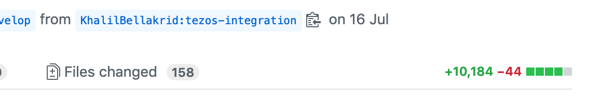

- Proof of Concept: `0001-modularization`.
- State: `draft`.
- Date Created: 2019/08/30
- Date Updated: 2019/08/30
- Author: [Dimitri Sabadie](https://github.com/phaazon)
- Summary: a small PoC to showcase how the core library can be segregated and modularized by taking
  out the Ripple code and moving it into its own project.

<!-- vim-markdown-toc GFM -->

* [Motivation](#motivation)
  * [TL;DR](#tldr)
* [Content](#content)
  * [Main and overall idea](#main-and-overall-idea)
  * [Adding a new coin project](#adding-a-new-coin-project)
  * [IDLs](#idls)
  * [The database](#the-database)
  * [The operation, transactions, blocks, etc.](#the-operation-transactions-blocks-etc)
  * [The Services type](#the-services-type)
  * [The AbstractAccount (revisited) type](#the-abstractaccount-revisited-type)
  * [Implementing RippleLikeAccount](#implementing-ripplelikeaccount)
  * [Reversing analysis from bottom-up to top-down](#reversing-analysis-from-bottom-up-to-top-down)
* [Rationale](#rationale)
* [Related work](#related-work)
  * [djinni modification](#djinni-modification)
  * [Ubinder](#ubinder)

<!-- vim-markdown-toc -->

# Motivation
> Why such a PoC?

Coin integration has been a big topic in 2019. In order to ease integrating new coins, the core
library has to be split into smaller chunks in order to make it more maintainable and flexible.
Especially, but not limited to:

  1. Better _major releases_: being able to make a breaking change on a coin shouldn’t imply a new
    release of the whole library but only the coin sub-module.
  2. Better _minor releases_: adding a new coin should have zero impact on existing code — exception
    made for _dynamic dispatch_ code, such as code that lists every available coin, for instance.
  3. Better _abstraction and interface_: the most abstract unit of code must not depend on any
    implementation nor coin, but must provide hints and helpers to implement the coin sub-modules
    quick and safely.
  4. Better _interoperability_: finally, we want to be able to make it easy for other teams (Live,
    Vault, Backend) to interface with our system and _pick what they want_ instead of relying on a
    big monolith.

Just for the record, adding support of a new coin implies adding **hundreds of new files**,
modifying some of the abstract part of the library and introducing several **thousands of lines of
code**.



Finally, it is important to understand that this Proof of Concept is about implementation rather
than interface. Even if, as you will see through this document, interfaces will change, it is a
consequence of the internal redesigning. Easing interfacing is a completely different and
complementary topic. See the [Related work](#related-work) section for further details.

## TL;DR

A document exists that describes the formal process behind the PoC. You can find it
[here](../coin-migration.md).

# Content
> Content of the PoC with comments and step-by-step procedure.

## Main and overall idea

This [lucidchart](https://www.lucidchart.com/documents/edit/b71dff4b-8b4f-4a98-8348-b897fd593379/0_0)
document provides the overall idea. The `ledger-core` library is an abstract, completely
coin-agnostic rewrite of the `lib-ledger-core` library. Then each coin is a different library /
project. For instance, the `ledger-core-ripple` project provides support for the Ripple blockchain.

All libraries (base and coins) have three main parts:

  - IDLs, which are used to define the public interface that can be shared on foreign languages,
    such as _JavaScript_, _Scala_ / _JNI_, _React Native_, _Rust_, etc.
  - C++ interface, which is generated based on the IDLs and used internally by the Core library’s
    implementation.
  - The actual C++ implementation, implementing the various functionalities and coin features.

Adding a new coin implies creating a new project `ledger-core-<coin_name>`, provide a set of
IDLs and implement the C++ code to support the required features. That library can then be compiled
and exposed as e.g. a _npm_ package or a _Scala_ JAR.

## Adding a new coin project

With the current codebase, we don’t have any means to create or add new coins: you’re on your own.
This is not a problem for people who have been there for a while but for people not used to adding
coins, external contributions or newcomers, it’s overwhelming as they don’t know exactly what they
have to do.

With the `lc` script, it’s quite easy:

```
lc project new ripple
```

It creates everything needed to get started, among:

  - The files hierarchy.
  - The database migrations system.
  - The build system files (CMake).
  - The connection between `ledger-core-ripple`’s IDLs with `ledger-core`’s one, ensuring a complete
    and valid dependency relationship.

## IDLs

The IDL system, based on [djinni], has changed a bit. Some PRs have been pushed to [djinni] to make
it handle the segregation in a more elegant way. Most important changes:

  - A new tool utility was introduced: [lc], which serves as a *CLI for lib Core*.
  - The [generateBindings](../../tools/generateBindings.sh) and
    [generateBindingsRN](../../tools/generateBindingsRN.sh] scripts don’t have to be used anymore.
  - IDLs are used to generate interfaces for both the base library and coin ones. You need to
    generate the base one first before being able to work on coin-related IDLs.
  - Generate the base public interface with: `lc api`. Simple and fast. This operation, a bit
    special, generates a new kind of artifact: `core.yaml`, a collection of IDLs in a _library_-like
    object, encoded as YAML. It is located in [ledger-core/idl](../../ledger-core/idl).
  - Generate each coin’s public interface with: `lc project api <coin_name>`.

In our case, we are interested by Ripple, so we just generate the interface with:

```
lc project api ripple
```

## The database

In order to support persistence, database must be handled. The new design is that each coin has its
own versioning system but all version numbers live, currently, in the same database. In order to
prevent us from interfering with one another, we must implement and provide a small _tag-like_ type,
declared in `ledger-core-ripple/inc/database/migration.hpp`:

```cpp
struct XRPMigration {
  static int const coinID;
};
```

And in the `ledger-core-ripple/src/database/migration.cpp` file:

```cpp
int const XRPMigration::coinID = 144;
```

This value is not really meaningful for our purpose but you should stick to using values from
[SLIP-0044](https://github.com/satoshilabs/slips/blob/master/slip-0044.md#registered-coin-types) as
it should ensure the values are unique — and the migration system heavily relies on the uniqueness
of that value.

Then, we just have to implement the `migrate` and `rollback` functions to provide migrations for
Ripple. And that’s pretty much all for the database part.

## The operation, transactions, blocks, etc.

Most of the code of Ripple was easy to move around. The biggest pain point, so far, was to update
the `#include` statement and the public interfacing (because of the new IDL system), but nothing to
be really concerned about. It’s quite easy (long, but easy) to move code until we hit the
synchronizer code, which is very correlated and convoluted.

After trying to move things around, I quickly hit a reality: if I were to change the `WalletPool`
type, I was going to need to change pretty much 98% of our code, because wallets, accounts,
synchronizers, explorers, currencies and databases rely on it.

`OperationQuery` is now a bit special: instead of branching on the type of wallet (Bitcoin,
Ethereum, etc.) it now defines a virtual pure method (`inflateCompleteTransaction`) that must be
implemented by coin-code. It’s as simple as that.

## The Services type

The idea hit me as a joke at first but I eventually got tempted to adopt the idea. The idea was to
duplicate the `WalletPool` type but removing it from everything wallet, accounts, currencies and
factories. I realized that while auditing our code: when a e.g. Bitcoin account needs to perform
a synchronization or just be created, it relies on a Bitcoin wallet. Why? To grab the `WalletPool`.
Why? To grab the `ThreadDispatcher`, or the `LoggerApi`, or a `DatabaseSessionPool` or even a
`Preferences` object.

Those objects can be shared between all coins and thus were gathered in a type called `Services`.
That type provides several advantages:

  - It helps decoupling the code. Instead of relying on a big object with several links (i.e.
    account -> wallet -> walletpool -> thread dispatcher) to only use an object that is at the very
    end of one of the links, we can just put the “so-called” end-link object behind a single
    indirection (i.e. services -> thread dispatcher). We remove several layer of dependencies, which
    is a definite improvement in terms of flexibility
  - It allows to perform the segregation by simply _dropping_ the concept of wallets, wallet pools
    and accounts. Even though that might seem to be a bad idea at first, it’s actually an
    interesting way to go, because it means that we’re going to work on a smaller scope with less
    dependencies.
  - We can challenge our wallet, wallet pools and account abstractions. After all, why should those
    abstractions be ours, instead of pushing those abstractions to Live or Vault?

## The AbstractAccount (revisited) type

Trying to implement `RippleLikeAccount` is still challenging, because we have pointers to `Wallet`
objects. As stated above, we pretty much never actually need wallets, but transitive dependencies,
such as thread dispatchers, database handles, loggers, etc. There is one exception though: we
sometimes need the UID of the wallet. That is needed to generate the UID of the Ripple account,
according to [this](https://github.com/bitcoin/bips/blob/master/bip-0032.mediawiki).

Instead of depending on `Wallet`, initialization code now explicitly states what it needs from
actual implementations (i.e. UIDs, for instance). Everywhere else we needed a `Wallet`, it’s now
replaced by a `Services` object, removing the long list of dependencies induced by wallets.

`AbstractAccount` directly depends on `OperationQuery`, which depends on `Operation`. They both have
pointers to ERC20 tokens and stuff, so some cleaning must be done here. The big problem here is the
database, because lots of code depends on it. The typical workflow I had:

  - Try to compile a type. If it doesn’t compile because of its dependencies, rename the `Type.cpp`
    file into `Type.bck` and move its dependencies into the projects.
  - Repeat that name/move loop until something that doesn’t compile doesn’t have any failing
    dependency (i.e. the failures are linked to the type directly and not its dependencies) or
    until everything compiles if it was just missing code.
  - Fix the code by moving abstractions / removing coin-dependent code.

## Implementing RippleLikeAccount

Implementing `RippleLikeAccount` is blocked by, recursively:

  - `AbstractAccount`, which must be available.
    - `OperationQuery`, which is exposed via `getOperationQuery`. An `OperationQuery` is an ORM-like
      structure allowing to perform smart computations on `Operation`.
    - `Operation`, which is a more user-friendly form of a _blockchain transaction_.
  - `AbstractWallet`.
  - `RippleLikeBlockchainExplorer`.
  - `RippleLikeBlockchainObserver`.
  - `RippleLikeAccountSynchronizer`.
  - `RippleLikeKeychain`.
  - Various internals, such as database support, network parameters, etc.

## Reversing analysis from bottom-up to top-down

Currently, I’ve tried to go from transactions, operations etc. up to account and wallet. Maybe we
can now go the other way around and see if we can abstract wallets enough.

# Rationale
> Should we go for it? Drop it?

The first feedback is that such a change was not that trivial. Lots of coupled parts of the code
had to be taken out, moved and refactored. `WalletPool`, `Currency`, `Wallet`, `Operation`,
`OperationQuery` and `NetworkParameters` are heat points and we need to keep them in mind.

However, it is quite obvious that we need that change to be able to grow the library internally.
Adding a new coin shouldn’t imply modifying dozens of not hundreds of files, spreading thousands of
lines of code.

Once the Ripple coin is completely done, the abstract library will have changed quite a lot in
terms of interface, easing integration of all the other remaining coins. The document aforementioned
in the [TL;DR](#tldr) section will provide everything for people (us, the Core Team, other Ledger
teams’ members but also external contributors) to get starting and add new coins.

# Related work
> What else has been done and is similar?

## djinni modification

[djinni] got modified.

  - [Native callback support](https://github.com/LedgerHQ/djinni/pull/22): that change was required
    because we need a `YAML` [djinni] library (more on this
    [here](https://github.com/LedgerHQ/djinni#modularization-and-library-support)). That change
    introduced several new native types:
      - `callback1`: A callback taking one argument.
      - `callback2`: A callback taking two arguments.
      - …
      - `callback15`: A callback taking fifteen arguments.
  - That change was required because we use monomorphized callbacks in the current legacy code and
    a patch of ours to generate them based on a typename (i.e. if you have `Callback[i32]`, you get,
    as interface, the monormophized `I32Callback` type). With my change, that type must be rewritten
    as `callback2<void, optional<i32>, optional<Error>>`. It’s a little more verbose but since
    `callback2` is now a higher-kinded native type recognized by [djinni], we can embed it in YAML
    libraries. The generated interface, for C++, is
    `std::function<void (std::optional<int32_t>, std:optional<Error>)>`.
  - The `void` type was added so that callbacks can be used correctly without having to use _dummy_
    arguments.

## Ubinder

[Ubinder] — which stands for **U**niversal **binder** is a C++ library for creating asynchronous
bindings on various languages/environments. It is currently authored, maintained and designed by
[\@teams2ua]. Per-se, the segregation doesn’t use it directly _so far_ but will eventually, since
both designs must converge at some time.

It’s important to notice that [Ubinder] needed to be taken into account when designing the whole
modularization process, because we want a smooth and easy learning curve and migration. [Ubinder]
doesn’t work with IDLs anymore but with a _wrapper_ and is heavily driven by serialization formats.
Instead of exposing objects, methods and functions in the foreign’s native representations, those
are exposed as blobs that must be serialized and are passed through a messaging channel (that
implements a _request-response_ pattern as well as a _notification_ system).

When we need to converge to [Ubinder], we will have to change a little bit the internal working of
the [lc] script (not to generate IDLs files anymore) but generate whatever serialization suits us
the most (so far, it looks like we’re heading towards [protobuf]).

[djinni]: https://github.com/LedgerHQ/djinni
[lc]: ../../tools/lc
[Ubinder]: https://github.com/LedgerHQ/ubinder
[\@teams2ua]: https://github.com/teams2ua
[protobuf]: https://developers.google.com/protocol-buffers
